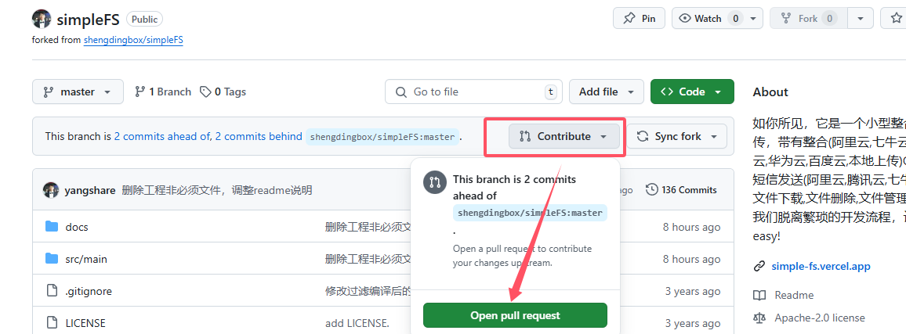

<div align="center">

<a href="http://marsview.cc/"></a>

# Marsview 低代码平台

让搭建更简单，让开发更高效

[项目文档](http://docs.marsview.cc/) |
[开源仓库](https://github.com/JackySoft/marsview) |
[交流群](https://imgcloud.cdn.bcebos.com/f35323e9a2625a85909cb6f02.png)

</div>

<div align="center">


[English](./README.md) | 中文

</div>

## 介绍 🚀

Marsview 是一款中后台方向的低代码可视化搭建平台，开发者可以在平台上创建项目、页面和组件，支持事件交互、接口调用、数据联动和逻辑编排等，开发者还可通过微前端框架 microApp 快速集成到自己的业务系统中。

## 在线使用 🛸

- 🌍 [Marsview](http://www.marsview.cc/)

|                                                                        |                                                                        |
| ---------------------------------------------------------------------- | ---------------------------------------------------------------------- |
|  |  |
|  |  |
|  |  |
|  |  |

## 特色 💥

- **项目：**
  项目配置（主题色、菜单布局、系统 Logo、面包屑...）、完整的 RBAC 的权限管理。
- **页面：** 页面创建、页面主题、页面配置、组件拖拽、样式配置、事件流配置、逻辑编排、接口配置。
  页面支持通过微服务的方式集成到传统项目中，无论你是 Vue 还是 React。
- **权限：** 项目和页面支持开发者和访问者权限配置，项目还支持菜单、按钮级别的 RBAC 控制。
- **自定义组件：** 当平台提供的组件满足不了需求时，可以自定义开发业务组件，平台会在线编译，上传到云端，同时在编辑器界面自定义组件中可以点击进行加载。
- **接口：** 接口统一管理，全局拦截器、返回结构修改等。支持 GET、POST、PUT、DELETE 等请求方式，支持接口动态参数传递。
- **事件流：** 通过事件流可以完成高难度的业务逻辑编排，比如：组件联动、组件显隐、组件禁用、自定义逻辑处理、接口调用、路由跳转等。
- **环境：** 平台支持三套环境，STG、PRE 和 PRD，页面只有发布到对应环境后，才可以在用户端访问到该页面。
- **回滚：** 平台发布后的页面支持一键回滚。
- **微服务：** 如果你是传统的 Vue 项目，想使用此平台，可以先在平台搭建一个页面发布到 PRD 环境，最后通过微服务集成进来。
- 后端提供 JAVA(本仓库，属于社区支撑) 和 Nodejs（官方支撑） 两个版本，数据库为 Mysql。

## 本地开发 👨‍💻

### 前端仓库

```bash
# 克隆代码
git clone https://github.com/JackySoft/marsview.git
```

# 一、启动入口
> MarsViewApplication.java

# 二、运行配置
- `application.yml`
## 邮箱【非必须】
```yaml
spring:
  #邮箱配置
  mail:
    #示例：smtp.qq.com
    host:
    #示例：marsview@qq.com
    username:
    #示例：nqmblqofepasgjhd，qq邮箱获取https://service.mail.qq.com/detail/0/75
    password:
    properties: { 'mail.smtp.ssl.enable', true }
    #如果启动就检查邮箱配置是否连接正常配置为true
    test-connection: false
    protocol: smtps
    port: 465

```

## redis【必须】
```yaml
spring:
  #redis配置
  data:
    redis:
      host: 192.168.6.3
      port: 6379
      password:
      database: 7
```
## 数据库【必须】
```yaml
spring:
  datasource:
    url: jdbc:mysql://192.168.6.3:3308/mars?useUnicode=true&characterEncoding=utf-8&serverTimezone=Asia/Shanghai
    username: root
    password: yang
    driver-class-name: com.mysql.cj.jdbc.Driver
```


# 三、云存储
## 配置
- `pom.xml`
```xml
<dependency>
    <groupId>io.github.yangshare</groupId>
    <artifactId>simpleFS</artifactId>
    <version>1.0.6</version>
    <scope>system</scope>
    <systemPath>${project.basedir}/lib/simpleFS-1.0.6.jar</systemPath>
</dependency>
<!--这里以七牛云oss为例，其他云存储类似-->
<dependency>
     <groupId>com.qiniu</groupId>
      <artifactId>qiniu-java-sdk</artifactId>
      <version>7.17.0</version>
</dependency>
```
- `application-oss.yml`
```yaml
simple-fs:
  local:
    local-file-path: 本地路径
    local-url: 本机访问地址
  oss:
    access-key: 阿里云OSS授权AK
    secret-key: 阿里云OSS授权SK
    endpoint: 阿里云OSS地域
    domain-url: 阿里云OSS访问地址
    bucket-name: 阿里云OSS空间名称
  fast:
    user-name: FASTDFS用户名
    pass-word: FASTDFS密码
    server-url: FASTDFS上传地址
    domain-url: FASTDFS访问地址
  huawei:
    access-key: 华为对象存储授权AK
    secret-key: 华为对象存储授权SK
    endpoint: 华为对象存储地域
    domain-url: 华为对象存储访问地址
    bucket-name: 华为对象存储空间名称
  bos:
    access-key: 百度bos授权AK
    secret-key: 百度bos授权SK
    endpoint: 百度bos地域
    domain-url: 百度bos访问地址
    bucket-name: 百度bos空间名称
  qcloud:
    access-key: 腾讯云cos授权AK
    secret-key: 腾讯云cos授权SK
    endpoint: 腾讯云cos地域
    domain-url: 腾讯云cos访问地址
    bucket-name: 腾讯云cos空间名称
    region: 腾讯云cos地域
  qiniu:
    access-key: 七牛云授权AK
    secret-key: 七牛云授权SK
    domain-url: 七牛云访问地址
    bucket-name: 七牛云空间名称
    region: 七牛云地域
  upai:
    user-name: 又拍云用户名
    pass-word: 又拍云密码
    domain-url: 又拍云访问地址
    bucket-name: 又拍云空间名称
  smms:
    user-name: smms用户名
    token: smms-Token
    pass-word: smms密码
  github:
    repository: github仓库
    user: github用户名
    token: githubToken
  aws:
    access-key: AWS授权AK
    secret-key: AWS授权SK
    endpoint: AWS地域
    bucket-name: AWS空间名称
    region: AWS地域
    domain-url: AWS访问地址
```
> 用到哪家oss就配置哪家即可，代码怎么判断的看下面【开发】章节。

## 开发
> [参考文档](https://github.com/yangshare/simpleFS)

- 七牛云OSS最佳实践
```yaml
simple-fs:
    qiniu:
      access-key: C9bwMJW-OKA猜猜我改了什么31inE_fGg
      secret-key: tVMWV8AU6J4kxbA猜猜我改了什么EuSn-1Vb
      domain-url: https://oss.yangshare.com
      bucket-name: yangshare-blog
      region: z2
```

```java
package com.zhouzifei.oss;

import com.zhouzifei.tool.config.QiniuFileProperties;
import com.zhouzifei.tool.config.SimpleFsProperties;
import com.zhouzifei.tool.consts.StorageTypeConst;
import com.zhouzifei.tool.dto.VirtualFile;
import com.zhouzifei.tool.listener.ProgressListener;
import com.zhouzifei.tool.service.ApiClient;
import com.zhouzifei.tool.service.FileUploader;
import lombok.SneakyThrows;
import org.junit.jupiter.api.Test;
import org.springframework.beans.factory.annotation.Autowired;
import org.springframework.boot.autoconfigure.SpringBootApplication;
import org.springframework.boot.test.context.SpringBootTest;
import org.springframework.test.context.ActiveProfiles;
import org.springframework.util.ResourceUtils;

import java.io.FileInputStream;

@SpringBootApplication(scanBasePackages = "com.zhouzifei.*")
@SpringBootTest
@ActiveProfiles("oss")
public class OssTemplateTest {

    @Autowired
    private SimpleFsProperties simpleFsProperties;

    /**
     * 测试用文件名,该文件在测试资源文件夹下
     */
    private static final String TEST_OBJECT_NAME = "test.txt";

    @Test
    @SneakyThrows
    public void test() {
        System.out.println(simpleFsProperties);
        ProgressListener progressListener = new ProgressListener() {
            @Override
            public void start(String s) {
                System.out.println("开始上传");
            }

            @Override
            public void process(int i, int i1) {
                System.out.println("i=" + i);
                System.out.println("i1=" + i1);
            }

            @Override
            public void end(VirtualFile virtualFile) {
                System.out.println("上传完成");
                System.out.println(virtualFile);

            }
        };
        QiniuFileProperties qiniuFileProperties = simpleFsProperties.getQiniu();
        System.out.println(qiniuFileProperties);

        String domainUrl = qiniuFileProperties.getDomainUrl();
        String accessKey = qiniuFileProperties.getAccessKey();
        String secretKey = qiniuFileProperties.getSecretKey();
        String region = qiniuFileProperties.getRegion();
        String bucketName = qiniuFileProperties.getBucketName();
        String storageType = StorageTypeConst.QINIUYUN.getStorageType();
        
        FileUploader uploader = FileUploader.builder()
                .simpleFsProperties(simpleFsProperties)
                .progressListener(progressListener)
                .domainUrl(domainUrl)
                .accessKey(accessKey)
                .secretKey(secretKey)
                .region(region)
                .bucketName(bucketName)
                .storageType(storageType)
                .build();

        ApiClient apiClient = uploader.execute();


        FileInputStream file = new FileInputStream(ResourceUtils.getFile(ResourceUtils.CLASSPATH_URL_PREFIX + TEST_OBJECT_NAME));

        VirtualFile virtualFile = apiClient.uploadFile(file, TEST_OBJECT_NAME);
        System.out.println(virtualFile.getFullFilePath());
        System.out.println(virtualFile.getFileHash());


    }

}

```
# 部署
> 部署方式二选一：tomcat、docker
## tomcat
1. 准备工作
- 安装 JDK：确保已安装 JDK，并配置好环境变量。
- 安装 Tomcat：下载并解压 Tomcat 到指定目录。
2. 修改 Spring Boot 项目pom.xml文件
```xml
<packaging>war</packaging> <!-- 修改这里为 war -->
```
3. 打包项目
- 打包成 WAR 文件：在项目根目录下运行以下命令。
```shell
mvn clean package
```
- 找到 WAR 文件：打包完成后，WAR 文件会生成在 target 目录下。
4. 部署到 Tomcat
- 将 WAR 文件复制到 Tomcat 的 webapps 目录：
```shell
cp target/your-app.war /path/to/tomcat/webapps/
```
- 启动 Tomcat：
```shell
tomcat安装目录/bin/startup.sh
```
5. 访问应用
- 打开浏览器，访问 http://localhost:9001/
## docker
1. 构建 Docker 镜像
- 在包含 Dockerfile 的目录下执行以下命令构建 Docker 镜像：
```sh
git clone https://github.com/JackySoft/marsview-backend.git
cd marsview-backend/java
docker build -t marsview4j:latest	
```
2. 运行 Docker 容器
- 使用以下命令启动 Docker 容器，并挂载配置文件目录：
```sh
docker run -d -p 9001:9001 -v /宿主机路径/conf:/app/conf marsview4j:latest
``` 
- -d 表示后台运行。
- -p 9001:9001 将容器的 9001 端口映射到宿主机的 9001 端口。
- -v /宿主机路径/conf:/app/conf 将宿主机的配置文件目录挂载到容器的 /app/conf 目录。
3. 访问应用
- 打开浏览器，访问 http://localhost:9001/
# 贡献

 > 欢迎大家贡献代码，提交PR。

## 代码规范
只有两条规则
- 代码尽量生成器，不要手写。[代码生成](https://baomidou.com/guides/mybatis-x/#%E4%BB%A3%E7%A0%81%E7%94%9F%E6%88%90)
- 手写代码请遵照[《阿里巴巴Java开发手册（终极版）》](https://developer.aliyun.com/ebook/386/read)，接口添加文档注解[Knife4j](https://doc.xiaominfo.com/)

## pr规范
不用研究pr规范（发起pr自然就有模板），提交pr之前先fork项目，然后在自己的仓库里`Open a pull request`

